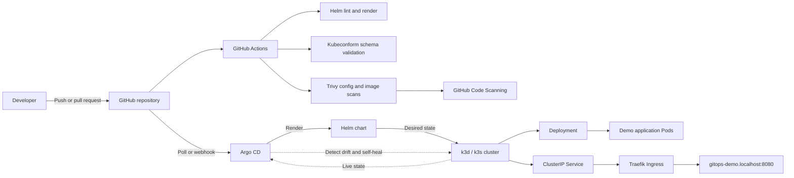

# Local Kubernetes GitOps Platform

[](https://github.com/Owasamly/local-kubernetes-gitops/actions/workflows/gitops-validation.yml)


A reproducible local GitOps platform that validates changes in GitHub Actions and continuously reconciles a hardened demonstration workload into a k3d Kubernetes cluster through Helm and Argo CD.

## What this project demonstrates

- Git as the source of truth for Kubernetes desired state;
- declarative application delivery with a Helm chart;
- automatic Argo CD synchronization, pruning and self-healing;
- an isolated Argo CD `AppProject` with restricted source and destination scope;
- reproducible local cluster creation with k3d;
- CI validation with Helm and Kubeconform;
- Kubernetes misconfiguration and container vulnerability scanning with Trivy;
- SARIF aggregation in GitHub Code Scanning;
- non-root workload execution and Kubernetes security hardening;
- observable GitOps scaling and drift-recovery demonstrations.

## Architecture



The application image is built locally and imported into k3d by the bootstrap script. Argo CD manages the Kubernetes configuration stored in `charts/demo-app`; it does not build containers.

## Delivery flow

1. A developer changes the Helm chart or application source.
2. GitHub Actions lints and renders the chart.
3. Kubeconform validates the rendered Kubernetes resources.
4. Trivy scans rendered manifests and the built container image.
5. SARIF results are uploaded to GitHub Code Scanning.
6. Argo CD observes the approved Git revision.
7. Argo CD renders the same Helm chart and reconciles the `demo` namespace.
8. Manual drift is automatically corrected because `selfHeal` is enabled.
9. Resources removed from Git are deleted because pruning is enabled.

## Components

| Component            | Responsibility                                                    |
| -------------------- | ----------------------------------------------------------------- |
| Docker               | Builds the unprivileged demonstration image                       |
| k3d / k3s            | Runs one local server node, two agent nodes and a load balancer   |
| Helm                 | Packages the Deployment, Service, Ingress and PodDisruptionBudget |
| Argo CD              | Continuously compares Git desired state with live cluster state   |
| Traefik              | Routes local HTTP traffic to the ClusterIP Service                |
| GitHub Actions       | Validates Helm and Kubernetes changes before reconciliation       |
| Kubeconform          | Checks rendered resources against Kubernetes schemas              |
| Trivy                | Scans Kubernetes configuration and the container image            |
| GitHub Code Scanning | Stores normalized SARIF findings                                  |

## Prerequisites

Install and configure:

- Docker with a running daemon;
- `kubectl`;
- k3d 5.x;
- Helm 3.x;
- GNU Make;
- Git and a GitHub account.

The tested local design uses Kubernetes `v1.35.5-k3s1`, one server and two agents. Approximately 4 GB of available memory is recommended.

## Quick start

Clone the repository and run the idempotent bootstrap:

```bash
git clone https://github.com/Owasamly/local-kubernetes-gitops.git
cd local-kubernetes-gitops

make bootstrap
```

The bootstrap performs the following operations:

- creates or starts the `gitops-dev` k3d cluster;
- waits for all Kubernetes nodes;
- builds `demo-app:local`;
- imports the image into the k3d nodes;
- installs Argo CD through its Helm chart;
- applies the restricted `AppProject` and `Application`;
- waits until `demo-app` is `Synced` and `Healthy`.

Open the application:

```text
http://gitops-demo.localhost:8080
```

## Access Argo CD

Start a local port-forward:

```bash
make argocd-ui
```

Open:

```text
http://localhost:8443
```

The username is `admin`. Obtain the initial local password in a separate terminal:

```bash
make argocd-password
```

Never commit or record this password.

## Verify the platform

Run the complete verification summary:

```bash
make verify
```

Or inspect individual resources:

```bash
kubectl get nodes -o wide

kubectl get application demo-app -n argocd \
  -o custom-columns='NAME:.metadata.name,SYNC:.status.sync.status,HEALTH:.status.health.status,REVISION:.status.sync.revision'

kubectl get deployment,pods,service,ingress -n demo -o wide
```

Expected application status:

```text
NAME       SYNC     HEALTH
demo-app   Synced   Healthy
```

## Demonstrate automatic Git synchronization

Change the desired replica count in `charts/demo-app/values.yaml`:

```yaml
replicaCount: 3
```

Commit and push:

```bash
git add charts/demo-app/values.yaml
git commit -m "demo: scale application through GitOps"
git push
```

Watch reconciliation:

```bash
kubectl get pods -n demo --watch
```

Argo CD changes briefly from `Synced` to `OutOfSync`, applies the new desired state and returns to `Synced / Healthy` with three Pods.

## Demonstrate self-healing

Introduce manual drift without changing Git:

```bash
kubectl scale deployment demo-app -n demo --replicas=1
kubectl get deployment demo-app -n demo --watch
```

Argo CD detects that the live replica count differs from Git and restores it automatically.

## CI validation and security

The workflow at [`.github/workflows/gitops-validation.yml`](.github/workflows/gitops-validation.yml) contains three parallel jobs:

### Helm Lint and Schema Validation

- runs strict Helm linting;
- renders the chart with production-like values;
- validates resources with Kubeconform;
- uploads the rendered manifest as a workflow artifact.

### Kubernetes Configuration Security

- renders the Helm chart;
- produces Trivy SARIF results;
- uploads findings to GitHub Code Scanning;
- blocks high and critical Kubernetes misconfigurations.

### Container Build and Vulnerability Scan

- builds the local demonstration image;
- uploads high and critical Trivy findings as SARIF;
- blocks fixed critical image vulnerabilities.

Reporting and enforcement are separate passes, ensuring that security evidence remains available even when a gate fails.

## Workload security

The chart applies:

- an unprivileged NGINX base image;
- non-root UID/GID execution;
- a read-only root filesystem;
- all Linux capabilities dropped;
- `RuntimeDefault` seccomp;
- disabled service-account token mounting;
- liveness and readiness probes;
- CPU and memory requests and limits;
- controlled rolling updates;
- a PodDisruptionBudget.

See [`security/README.md`](security/README.md) for the control model.

## Repository structure

```text
.
├── .github/workflows/
│   └── gitops-validation.yml       # CI validation and security gates
├── app/
│   ├── Dockerfile                  # Unprivileged demo container
│   └── index.html                  # Portfolio-friendly demonstration page
├── argocd/
│   ├── demo-app-application.yaml   # Automated sync, prune and self-heal
│   ├── demo-project.yaml           # Restricted source and destination scope
│   └── values.yaml                 # Local Argo CD Helm values
├── charts/demo-app/
│   ├── Chart.yaml
│   ├── values.yaml
│   └── templates/                  # Hardened Kubernetes resources
├── cluster/
│   ├── k3d-config.yaml             # One server, two agents, local ingress
│   ├── bootstrap.sh                # Idempotent environment installation
│   ├── verify.sh                   # Operational verification
│   └── destroy.sh                  # Local cluster cleanup
├── docs/
│   ├── ARCHITECTURE.md
│   ├── RECORDING_GUIDE.md
│   └── TROUBLESHOOTING.md
├── security/
│   ├── README.md
│   └── trivy.yaml
└── Makefile                        # Common local operations
```

The Helm chart is the single source of truth for the application resources. Duplicate raw manifests are intentionally not maintained.

## Useful commands

```bash
make bootstrap         # Create the complete platform
make verify            # Verify cluster, Argo CD and application health
make lint              # Run strict Helm linting
make render            # Render the chart into .rendered/
make security          # Scan rendered configuration with local Trivy
make status            # Show Argo CD and workload status
make argocd-ui         # Forward the Argo CD UI to localhost:8443
make argocd-password   # Print the local initial admin password
make destroy           # Delete the local k3d cluster
```

## Documentation

- [Architecture and trust boundaries](docs/ARCHITECTURE.md)
- [Screenshot and video recording guide](docs/RECORDING_GUIDE.md)
- [Troubleshooting](docs/TROUBLESHOOTING.md)
- [Security controls](security/README.md)

## Limitations and next steps

This project intentionally uses a local image import rather than a remote registry. A production extension could:

- publish images to GHCR using short-lived OIDC credentials;
- generate an SBOM with Syft;
- sign images with Cosign;
- verify signatures through Kyverno admission policies;
- manage secrets with External Secrets Operator or Vault;
- expose Argo CD through authenticated TLS ingress;
- add application promotion across development, staging and production.

## Author

**Osama Nurhussen Kahsay**

- GitHub: [@Owasamly](https://github.com/Owasamly)
- LinkedIn: [osama-nurhussen](https://www.linkedin.com/in/osama-nurhussen/)

## License

Distributed under the [MIT License](LICENSE).
