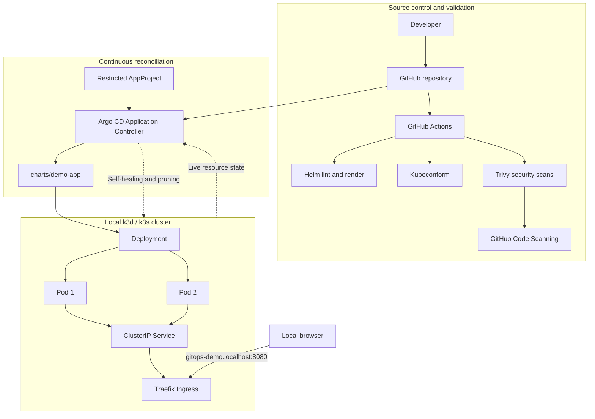

# Architecture

## System flow

## Reconciliation model

Git contains the desired state. Argo CD periodically compares the revision at `main:charts/demo-app` with resources in the `demo` namespace.

- `automated.prune: true` removes resources deleted from Git.
- `automated.selfHeal: true` reverses out-of-band cluster changes.
- `CreateNamespace=true` allows the Application to create `demo`.
- `ApplyOutOfSyncOnly=true` avoids reapplying unchanged resources.
- `PruneLast=true` delays deletion until healthy replacements are applied.

## Trust boundaries

### GitHub Actions

CI is a validation boundary, not the deployment mechanism. It renders and evaluates the desired state but does not hold kubeconfig access to the local cluster.

### Argo CD

Argo CD has cluster reconciliation privileges. The `local-gitops` AppProject restricts it to:

- source: `https://github.com/Owasamly/local-kubernetes-gitops.git`;
- destination cluster: the in-cluster Kubernetes API;
- destination namespace: `demo`.

### Local container image

The bootstrap builds `demo-app:local` and imports it into k3d. This keeps the project self-contained but means Git alone cannot reproduce image bytes. A production implementation should use an immutable registry digest.

## Failure behaviour

| Failure                                 | Expected behaviour                                 |
| --------------------------------------- | -------------------------------------------------- |
| Invalid Helm template                   | CI lint/render job fails                           |
| Invalid Kubernetes schema               | Kubeconform job fails                              |
| High/critical manifest misconfiguration | Trivy configuration gate fails                     |
| Fixed critical image vulnerability      | Trivy image gate fails                             |
| Manual replica change                   | Argo CD restores the Git value                     |
| Resource removed from Git               | Argo CD prunes the live resource                   |
| Repository unavailable                  | Existing workload continues; sync reports an error |
